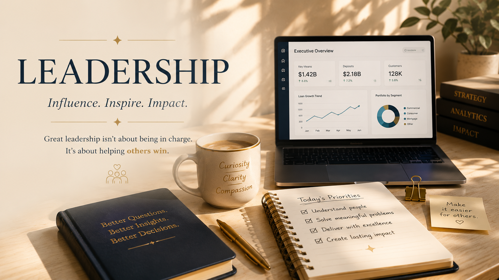

  

# Leadership

> *"Great leadership isn't measured by the number of people who report to you.*
>
> *It's measured by the number of people whose work becomes easier because of you."*

---

## Leadership Looks Different Than I Once Imagined

When I first started my career, I believed leadership meant managing a team.

I thought it began with a promotion, a title, or years of experience.

The more I worked with talented people across different teams, the more I realized I had it backwards.

Leadership often begins much earlier.

It starts when you take ownership without being asked.

When you simplify something that frustrates everyone else.

When you ask better questions.

When you help someone succeed—even if no one notices.

That has become the kind of professional I strive to be.

## What Leadership Means to Me

To me, leadership isn't about being the loudest voice in the room.

It's about creating clarity when things feel complicated.

It's helping people trust data instead of guessing.

It's making dashboards that answer questions before they're asked.

It's documenting work so someone else doesn't have to start from scratch.

It's leaving every project better than I found it.

Those small decisions add up over time.

That's the kind of impact I hope to have.

## Leadership in Practice

### AI Governance Committee

Contributing to conversations around responsible AI adoption, governance, and the thoughtful integration of emerging technologies into business processes.

---

### Executive Reporting

Designing dashboards and reporting solutions that help leadership teams monitor lending, deposits, customer growth, and operational performance with confidence.

---

### Cross-Functional Collaboration

Partnering with business stakeholders, technology teams, analysts, and leadership to translate business questions into practical analytical solutions.

---

### Continuous Improvement

Looking beyond the immediate request to identify opportunities for automation, simplification, and long-term process improvement.

## Things I Believe

• Curiosity creates better questions.

• Simplicity is underrated.

• Great dashboards tell stories, not just numbers.

• The best solutions begin with listening.

• Kindness scales.

• Technology should make work feel lighter, not heavier.

• Every project is an opportunity to learn something new.

## Looking Ahead

Every new project gives me another opportunity to learn, collaborate, and create something meaningful.

Whether I'm building executive dashboards, designing AI-enabled lending workflows, or helping teams make better decisions with data, my goal remains the same:

To leave people, processes, and products better than I found them.

---

### Continue Reading →

💭 [My Thinking →](my-thinking.md)
