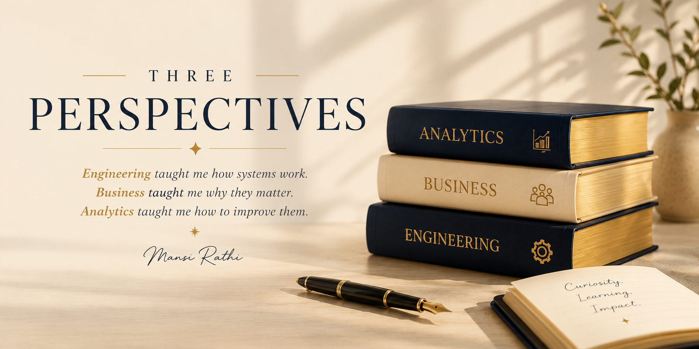

  

# Three Perspectives

> *"I never set out to collect degrees.*
>
> *I was simply following my curiosity."*

---

## More Than Three Diplomas

People often notice that I have three degrees.

A Bachelor's in Engineering.

An MBA in Technology Management.

A Master's in Business Analytics.

But when I look back, I don't see three separate qualifications.

I see three different ways of understanding the world.

Each one changed how I approach problems, make decisions, and build solutions.

---

# Engineering

### Learning How Systems Work

My journey began with Electronics and Telecommunication Engineering.

Engineering taught me to think in systems.

Every problem had constraints.

Every solution required structure.

Every decision involved trade-offs.

Long before I ever built dashboards, I learned how to break complex problems into smaller pieces and design solutions that were reliable, scalable, and logical.

That mindset still influences every data model and reporting solution I build today.

---

# Business

### Understanding Why They Matter

As I moved into an MBA in Technology Management, my perspective shifted.

Technology alone doesn't create value.

Businesses do.

I became fascinated by strategy, leadership, customer behavior, and organizational decision-making.

Instead of asking,

*"Can we build this?"*

I started asking,

*"Should we build this?"*

That simple shift changed how I think about analytics forever.

---

# Analytics

### Turning Information Into Decisions

My Master's in Business Analytics connected everything together.

Engineering gave me structure.

Business gave me context.

Analytics became the bridge between them.

Here I learned to transform raw data into meaningful insights using statistics, visualization, SQL, Python, machine learning, and business intelligence.

More importantly, I learned that the best dashboards don't simply display numbers.

They help people make better decisions.

---

# Bringing It All Together

Looking back, I don't think these degrees represent three different chapters.

They represent one continuous journey.

Engineering taught me how systems work.

Business taught me why they matter.

Analytics taught me how to improve them.

Today, whenever I build executive dashboards, design AI-powered lending solutions, or create reporting systems, I naturally combine all three perspectives.

It's no longer about engineering.

Or business.

Or analytics.

It's about understanding the complete picture.

---

# Today

That mindset continues to shape the work I do every day.

Whether I'm designing executive dashboards in IBM Cognos, building reporting solutions in Power BI, or developing AI-enabled lending workflows, I try to approach every challenge from multiple perspectives before writing a single line of SQL or creating a visualization.

Curiosity led me to three degrees.

Those three perspectives continue to shape every project I build.

---

### Continue Reading →

🏆 [One Unexpected Opportunity →](times-square.md)

