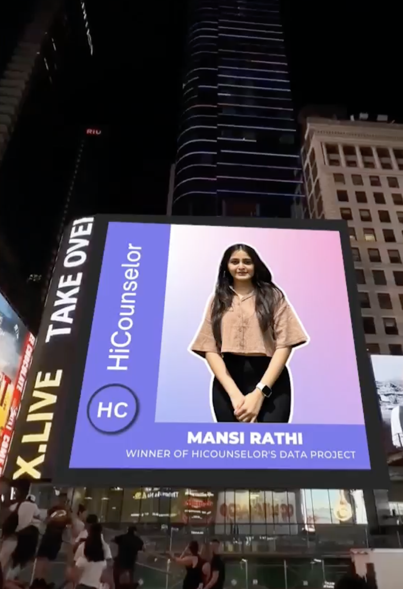
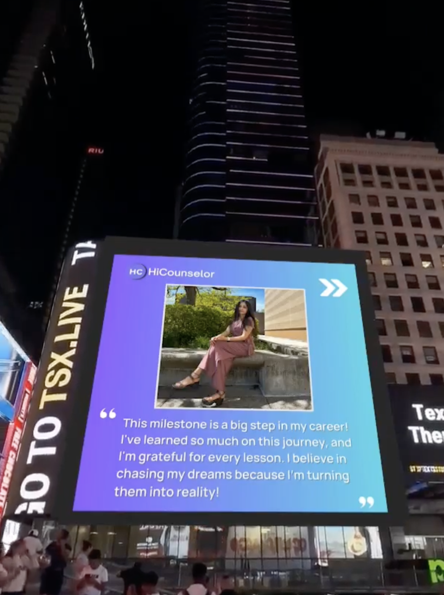
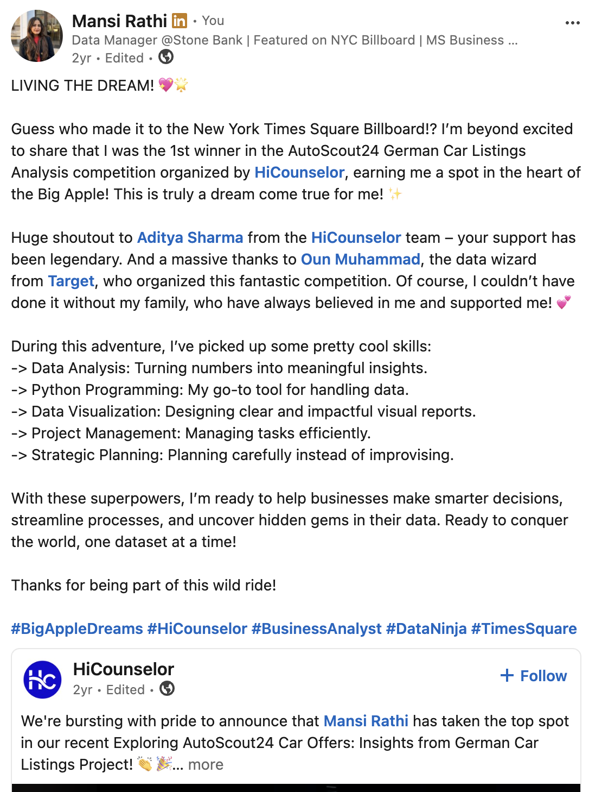
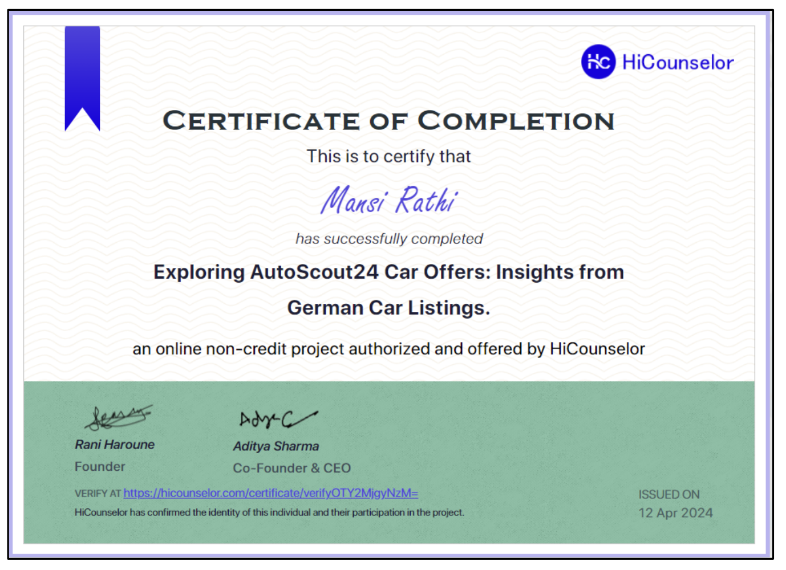

  

# Featured on Times Square

> *"Some milestones aren't measured by where you stand.*
>
> *They're measured by how far you've come."*

---

## One Unexpected Opportunity

When I joined HiCounselor's **AutoScout24 German Car Listings Analytics Challenge**, my goal wasn't to win a competition.

I wanted to challenge myself with a real business problem, strengthen my analytical thinking, and learn how to communicate insights through data.

I spent days exploring marketplace trends, cleaning data, building visualizations, and asking better business questions.

What started as a learning experience eventually became one of the most memorable milestones of my career.

---

## The Moment

Seeing my work displayed in **New York City's Times Square** was something I had never imagined when I first opened the dataset.

It was a reminder that meaningful opportunities often begin with small decisions—to participate, to stay curious, and to keep learning.

  

  

---

## Sharing the Journey

Shortly after the announcement, I shared the experience with my professional network on LinkedIn.

Looking back, it's interesting to read those words again—they capture the excitement, gratitude, and optimism I felt in that moment.

  

---

# Official Recognition

Receiving the award was an incredible honor, but what mattered most was the journey behind it.

The competition challenged me to think beyond charts and code—to approach data through the lens of business strategy, storytelling, and decision-making.

  

---

## Looking Back

The recognition itself was unforgettable.

But the biggest lesson wasn't seeing my work on a billboard.

It was realizing that growth comes from saying **yes** to opportunities before you're completely ready.

That competition strengthened my confidence, sharpened my analytical thinking, and reminded me that great work often begins with curiosity rather than certainty.

It also reinforced something I still believe today:

> **Analytics is more than building dashboards. It's about solving meaningful problems, telling clear stories with data, and creating decisions people can trust.**

---

## Explore the Complete Project

The recognition featured on this page was made possible through my work on the AutoScout24 Marketplace Analytics challenge.

If you'd like to explore the complete business case study—including the methodology, dashboard design, business insights, and recommendations—you can find it here.

### → [AutoScout24 Marketplace Analytics](https://github.com/heymansirathi/AutoScout24-Marketplace-Analytics)
